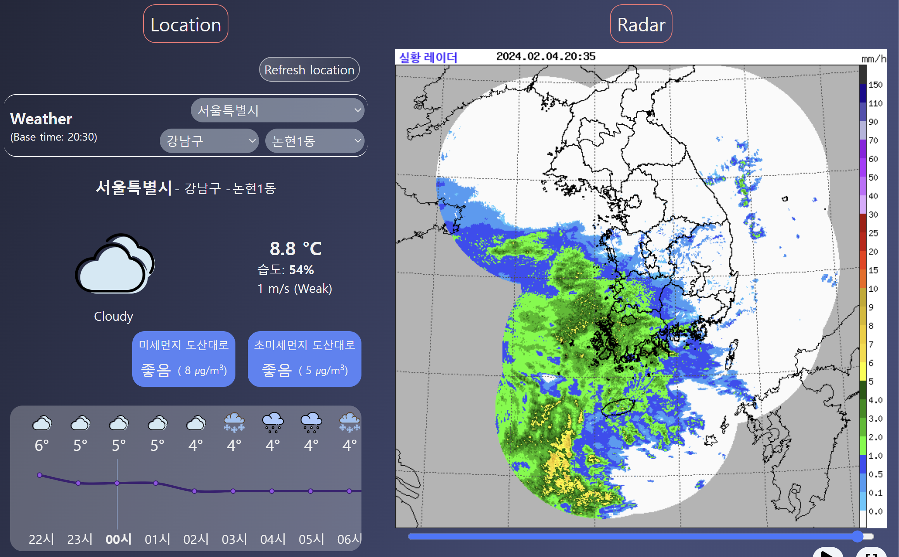

# Weather App

## Description

This application uses different API to provide the weather at the user's location in South Korea. It also includes some global weather situation in South Korea such as the precipitation radar and the micro-particles radar.

Currently, there are different tab such as the Home that
displays the current location's weather, and the radar images. You can change the location by clicking on the different select tabs to see other cities' weather.

[location](src/images/location_miniature.png)

The location tabs shows only the location, with the same select that enable you to see the weather in other cities.

[liste](src/images/liste_miniature.png)
[liste2](src/images/liste_miniature_2.png)

The list tab enables you to make a list of cities that you want to display. You can swipe left and right to check through your personnal list, or click on the tab button at the bottom.

## API used

- Short-range weather prediction (Korea Meteorological Administration)
- Radar Video (Korea Meteorological Administration)
- Atmospheric pollution (Korea Environment Corporation)

- 단기예보 조회서비스 (기상청)
- 레이더영상 조회서비스 (기상청)
- 대기오염정보 (한국환경공단)
